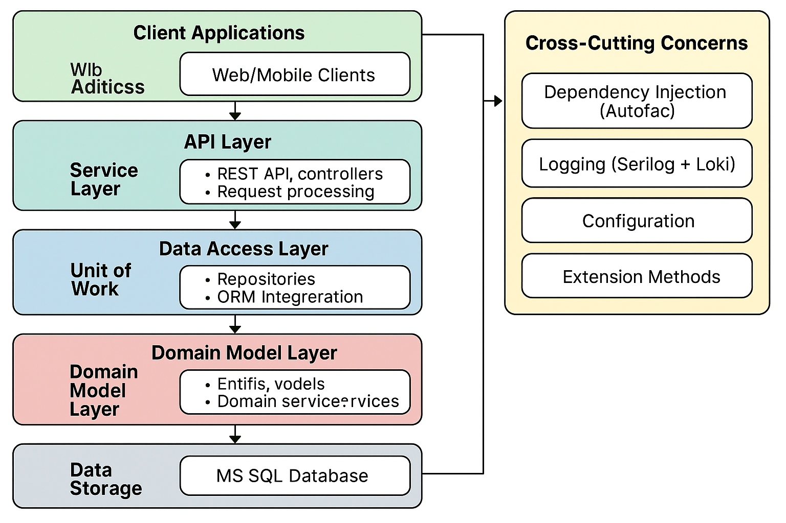

# ProjectStructure01 - .NET 企業級架構範例專案



這是一個使用 .NET 8 建構的企業級 Web API 專案，旨在展示現代化的架構設計、設計模式應用以及 .NET 開發最佳實踐。此專案實作了多層架構和領域驅動設計的概念，並支援多種 ORM 實現，適合作為中大型專案的起點或學習參考。

## 架構概覽

專案架構遵循清晰的責任分離原則，採用多層設計：

```
┌─────────────────────────┐
│         API 層          │ ← REST API、控制器、請求處理
├─────────────────────────┤
│        服務層           │ ← 業務邏輯、驗證、協調
├─────────────────────────┤
│       資料存取層         │ ← 儲存庫、ORM 整合
├─────────────────────────┤
│       領域模型層         │ ← 實體、DTO、資料模型
└─────────────────────────┘
```

專案分為兩個主要部分：

### 1. ProjectStructure.Share (類別庫)

共享元件庫，包含：

- **Attributes**: 包含自訂屬性，如用於依賴注入標記的 `DIAttribute`
- **Configs**: 配置類別，如 `MsSQLConfig`
- **DTOs**: 數據傳輸物件，用於 API 請求和回應
- **Entities**: 資料庫實體類別和 DbContext
- **Enums**: 列舉定義，如 `RepositoryImplementationType`
- **Extensions**: 擴展方法，如字串擴展和控制器擴展
- **Filter**: 全局異常處理過濾器
- **Interfaces**: 服務和儲存庫的介面定義
- **Profiles**: AutoMapper 映射配置

### 2. ProjectStructure01 (主專案)

實現類別庫中定義的介面和功能：

- **Controllers**: 處理 HTTP 請求的 API 控制器
- **Repositories**: 
  - `EfRepository`: Entity Framework Core 實現
  - `DapperRepository`: Dapper 實現
  - `UnitOfWork`: 工作單元模式實現
  - `RepositoryFactory`: 不同 ORM 的工廠模式實現
- **Services**: 業務邏輯層實現

## 專案結構圖

```
ProjectStructure01
├── 📂 ProjectStructure.Share (類別庫)
│   ├── 📂 Attributes
│   │   └── DIAttribute.cs
│   ├── 📂 Configs
│   │   └── MsSQLConfig.cs
│   ├── 📂 DTOs
│   │   ├── ApiResult.cs
│   │   └── 📂 User
│   │       ├── InCreateUserDto.cs
│   │       ├── InUpdateUserDto.cs
│   │       └── OutUserDto.cs
│   ├── 📂 Entities
│   │   └── 📂 MsSQL
│   │       ├── MsSQLContext.cs
│   │       └── User.cs
│   ├── 📂 Enums
│   │   └── RepositoryImplementationType.cs
│   ├── 📂 Extensions
│   │   ├── ControllerExtensions.cs
│   │   └── StringExtensions.cs
│   ├── 📂 Filter
│   │   └── GlobalExceptionFilter.cs
│   ├── 📂 Interfaces
│   │   ├── 📂 Repositories
│   │   │   ├── IRepository.cs
│   │   │   ├── IRepositoryFactory.cs
│   │   │   └── IUnitOfWork.cs
│   │   └── 📂 Services
│   │       └── IUserService.cs
│   └── 📂 Profiles
│       └── UserProfile.cs
│
└── 📂 ProjectStructure01 (主專案)
    ├── 📂 Controllers
    │   └── 📂 v1
    │       └── UsersController.cs
    ├── 📂 Repositories
    │   ├── DapperRepository.cs
    │   ├── EfRepository.cs
    │   ├── RepositoryFactory.cs
    │   └── UnitOfWork.cs
    ├── 📂 Services
    │   └── UserService.cs
    ├── 📂 Migrations
    │   └── 📂 MsSQL
    ├── ConfigureSwaggerOptions.cs
    ├── MsSQLContextFactory.cs
    ├── Program.cs
    └── appsettings.json
```

## 技術棧

- **.NET 8**: 最新的 .NET 基礎框架
- **ASP.NET Core Web API**: Web API 實現
- **Entity Framework Core**: 功能完整的 ORM 框架
- **Dapper**: 高性能輕量級 ORM
- **AutoMapper**: 自動化物件映射
- **Autofac**: 進階依賴注入容器
- **Serilog + Grafana Loki**: 結構化日誌與集中式日誌管理
- **Swagger (Swashbuckle)**: API 文件生成與測試界面
- **ASP.NET Core API Versioning**: API 版本控制

## 設計模式與最佳實踐

專案中實現了多種設計模式和最佳實踐：

### 儲存庫模式與工作單元模式

- **儲存庫模式 (Repository Pattern)**: 提供資料存取的抽象層，隔離資料存取邏輯
- **工作單元模式 (Unit of Work Pattern)**: 管理交易和資料庫操作的一致性

### 其他設計模式

- **工廠模式 (Factory Pattern)**: 用於創建不同實現的儲存庫
- **依賴注入 (Dependency Injection)**: 實現鬆耦合的程式碼
- **DTO 模式 (Data Transfer Object)**: 分離內部資料模型和外部 API 模型
- **全局異常處理 (Global Exception Handling)**: 統一處理應用程式錯誤
- **統一 API 回應格式 (Unified API Response)**: 提供一致的 API 回應結構

## 資料庫設定

本專案使用 Entity Framework Core 的 Code-First 方法管理資料庫結構。資料庫模型如下：

### 資料庫遷移指令

#### 建立新的遷移

```bash
dotnet ef migrations add InitialCreate --context ProjectStructure.Share.Entities.MsSQL.MsSQLContext -o Migrations\MsSQL --project ..\ProjectStructure.Share\ProjectStructure.Share.csproj --startup-project .
```

#### 更新資料庫

```bash
dotnet ef database update --context ProjectStructure.Share.Entities.MsSQL.MsSQLContext --project ..\ProjectStructure.Share\ProjectStructure.Share.csproj --startup-project .
```

## 專案設定與啟動

### 環境配置

1. 修改 `appsettings.json` 或 `appsettings.Development.json` 中的資料庫連接字串：

```json
"MsSQLConfig": {
  "ConnectionString": "Server=localhost;Database=test_db_m;Trusted_Connection=True;TrustServerCertificate=True;"
}
```

2. 配置 Serilog 和 Grafana Loki (可選)：

```json
{
  "Serilog": {
    "MinimumLevel": {
      "Default": "Information",
      "Override": {
        "Microsoft": "Warning",
        "System": "Warning"
      }
    }
  },
  "LokiUrl": "http://localhost:3100"
}
```

### 啟動專案

```bash
cd ProjectStructure01
dotnet run
```

API 文件將在以下 URL 可用：
- Swagger UI: `https://localhost:<port>/swagger`

## API 設計

專案提供以下 RESTful API：

### 使用者管理 API (v1)

| 方法   | 端點                          | 描述                |
|-------|------------------------------|---------------------|
| GET   | api/v1/Users/GetAllUsers     | 獲取所有使用者        |
| GET   | api/v1/Users/GetUserById     | 根據 ID 獲取使用者    |
| POST  | api/v1/Users/CreateUser      | 創建新使用者          |
| PUT   | api/v1/Users/UpdateUser      | 更新使用者            |
| DELETE| api/v1/Users/DeleteUser      | 刪除使用者            |

所有 API 返回統一的回應格式：

```json
{
  "isSuccess": true,
  "code": 200,
  "result": { ... },
  "error": null
}
```

## 依賴注入與服務註冊

專案使用 Autofac 作為 DI 容器，並利用自訂的 `DIAttribute` 進行自動註冊。在 `Program.cs` 中：

```csharp
builder.Host.UseServiceProviderFactory(new AutofacServiceProviderFactory());
builder.Host.ConfigureContainer<ContainerBuilder>(builder =>
{
    builder.RegisterAssemblyTypes(AppDomain.CurrentDomain.GetAssemblies())
    .Where(t => t.GetCustomAttribute<DIAttribute>() != null)
    .AsImplementedInterfaces()
    .InstancePerLifetimeScope();
});
```

## ORM 切換機制

專案實現了靈活的 ORM 切換機制，可以在 Entity Framework Core 和 Dapper 之間選擇：

```csharp
// 獲取 EF Core 儲存庫 (預設)
var userRepository = _unitOfWork.GetRepository<User>();

// 獲取 Dapper 儲存庫
var userDapperRepository = _unitOfWork.GetRepository<User>(RepositoryImplementationType.Dapper);
```

這種設計允許在不同場景選擇最適合的 ORM 框架：

- 使用 EF Core 進行複雜的 CRUD 操作
- 使用 Dapper 進行高性能的查詢操作

## 全局異常處理

使用 `GlobalExceptionFilter` 實現統一的例外處理：

```csharp
public void OnException(ExceptionContext context)
{
    HttpStatusCode statusCode = HttpStatusCode.InternalServerError;
    string errorMessage = "發生了未處理的錯誤";

    // 根據異常類型設置不同的 HTTP 狀態碼和錯誤消息
    switch (context.Exception)
    {
        case ArgumentException argEx:
            statusCode = HttpStatusCode.BadRequest;
            errorMessage = argEx.Message;
            break;
        // ... 其他例外類型處理
    }

    // 創建 API 響應
    var apiResult = new ApiResult(statusCode, null, false, errorMessage);

    // 設置響應
    context.Result = new ObjectResult(apiResult)
    {
        StatusCode = (int)statusCode
    };

    // 標記異常已處理
    context.ExceptionHandled = true;
}
```

## API 版本控制

使用 ASP.NET Core API Versioning 實現 API 版本管理：

```csharp
builder.Services.AddApiVersioning(options =>
{
    options.DefaultApiVersion = new ApiVersion(1, 0);
    options.AssumeDefaultVersionWhenUnspecified = true;
    options.ReportApiVersions = true;
}).AddApiExplorer(options =>
{
    options.GroupNameFormat = "'v'VVV";
    options.SubstituteApiVersionInUrl = true;
});
```

控制器中的版本標記：

```csharp
[ApiController]
[ApiVersion("1.0")]
[Route("api/v{version:apiVersion}/[controller]/[action]")]
public class UsersController : ControllerBase
{
    // ...
}
```

## 日誌系統設計 - Serilog 與 Grafana Loki 整合

本專案實現了現代化的日誌系統，使用 Serilog 進行日誌記錄，並結合 Grafana Loki 進行集中式日誌管理和查詢。這種組合提供了強大的日誌功能，適用於開發環境和生產環境。

### 日誌系統架構

```
┌─────────────────┐       ┌──────────────┐      ┌─────────────┐      ┌─────────────┐
│  ASP.NET Core   │       │              │      │             │      │             │
│ 應用程式         │──────▶│  Serilog     │─────▶│  Loki       │─────▶│  Grafana    │
│ (ProjectStructure01) │  │  (記錄/格式化) │      │  (儲存/索引) │      │  (查詢/展示) │
└─────────────────┘       └──────────────┘      └─────────────┘      └─────────────┘
        │                                             ▲                      ▲
        │                                             │                      │
        │                 ┌──────────────────────────┐│                      │
        └────────────────▶│    Docker Compose        ││                      │
                          │ (容器化服務管理)          ││                      │
                          └──────────────────────────┘│                      │
                                     │                │                      │
                                     │                │                      │
                                     ▼                │                      │
                          ┌──────────────────────────┐│                      │
                          │   Loki 配置               ││                      │
                          │ (loki-config.yaml)       │└──────────────────────┘
                          └──────────────────────────┘
```

### 核心組件說明

1. **Serilog**：
   - 在應用程式中負責捕獲和格式化日誌
   - 支援結構化日誌記錄，便於後續分析
   - 配置豐富的日誌內容，包括時間戳、日誌級別、來源上下文等

2. **Grafana Loki**：
   - 輕量級、高效能的日誌聚合系統
   - 使用標籤進行日誌索引，而非全文索引，降低資源消耗
   - 支援 LogQL 查詢語言，提供強大的日誌過濾和搜索能力

3. **Grafana 儀表板**：
   - 日誌的視覺化界面
   - 提供豐富的查詢和過濾功能
   - 支援創建自定義儀表板和告警

### Docker 容器化配置

本專案使用 Docker Compose 進行容器化部署，`docker-compose.yaml` 文件定義了 Loki 和 Grafana 服務：

```yaml
version: "3.3"

networks:
  loki:

services:
  loki:
    image: grafana/loki:latest
    ports:
      - "3100:3100"
    command: -config.file=/etc/loki/local-config.yaml
    networks:
      - loki

  grafana:
    image: grafana/grafana:latest
    environment:
      - GF_PATHS_PROVISIONING=/etc/grafana/provisioning
      - GF_AUTH_ANONYMOUS_ENABLED=true
      - GF_AUTH_ANONYMOUS_ORG_ROLE=Admin
    # ... 其他配置 ...
    ports:
      - "3000:3000"
    depends_on:
      - loki
    networks:
      - loki
```

### Loki 配置詳解

Loki 的配置通過 `loki-config.yaml` 文件進行管理，主要設置包括：

```yaml
# 基礎配置
auth_enabled: false  # 開發環境中禁用身份驗證
server:
  http_listen_port: 3100  # Loki HTTP API 監聽端口

# 儲存配置
storage:
  filesystem:
    chunks_directory: /tmp/loki/chunks  # 日誌塊儲存位置
    rules_directory: /tmp/loki/rules    # 規則儲存位置

# 緩存配置
query_range:
  results_cache:
    cache:
      embedded_cache:
        enabled: true
        max_size_mb: 100  # 結果緩存大小

# 日誌索引配置
schema_config:
  configs:
    - from: 2020-10-24
      store: tsdb  # 使用時間序列資料庫
      object_store: filesystem
      schema: v13
```

### 在應用程式中的整合

Serilog 在 `Program.cs` 中進行配置，並連接到 Loki：

```csharp
// 配置 Serilog
builder.Host.UseSerilog((context, services, configuration) =>
{
    configuration
        .MinimumLevel.Information()
        .Enrich.FromLogContext()
        .Enrich.WithProperty("Application", "ProjectStructure01")
        .Enrich.WithProperty("Environment", context.HostingEnvironment.EnvironmentName);

    // 開發環境增加控制台輸出
    if (context.HostingEnvironment.IsDevelopment())
    {
        configuration.WriteTo.Console();
    }

    // 連接到 Grafana Loki
    configuration.WriteTo.GrafanaLoki(
        "http://localhost:3100",
        labels: new[] {
            new LokiLabel { Key = "environment", Value = context.HostingEnvironment.EnvironmentName }
        },
        propertiesAsLabels: new[] { "level" },
        textFormatter: new JsonFormatter()
    );
});
```

### 日誌數據流程

1. **日誌產生**：
   - 應用程式中的操作產生日誌事件
   - 通過全局異常過濾器捕獲未處理的異常
   - HTTP 請求/響應日誌通過中間件自動記錄

2. **日誌處理與傳輸**：
   - Serilog 捕獲日誌事件並進行格式化
   - 根據環境不同，日誌同時發送至控制台和/或 Loki
   - 使用 Loki Sink 將日誌以 HTTP 形式發送至 Loki 服務

3. **日誌存儲與索引**：
   - Loki 接收並處理傳入的日誌
   - 根據標籤進行組織和索引
   - 將日誌內容壓縮並儲存於文件系統

4. **日誌查詢與可視化**：
   - 通過 Grafana UI（默認訪問 http://localhost:3000）查詢日誌
   - 使用 LogQL 語法進行高級查詢和過濾
   - 創建自定義儀表板進行監控和分析

### 使用案例

1. **開發調試**：
   - 實時監控應用程式日誌，快速定位問題
   - 過濾特定請求或操作的日誌鏈路

2. **性能分析**：
   - 監控特定 API 的響應時間
   - 分析數據庫操作效率

3. **錯誤監控與告警**：
   - 設置關鍵錯誤的告警通知
   - 追蹤錯誤趨勢和模式

4. **安全審計**：
   - 記錄使用者登入和敏感操作
   - 檢測異常行為模式

### 日誌系統優勢

1. **高效能**：Loki 的標籤索引方式比傳統全文索引更輕量
2. **高可擴展性**：支援水平擴展，適合從小型到大型系統
3. **強大的查詢能力**：LogQL 提供類似 SQL 的查詢語法
4. **與 Grafana 生態整合**：可與指標和追蹤數據結合分析
5. **低存儲成本**：有效的壓縮和索引策略減少存儲需求

## 架構特色與優勢

1. **ORM 靈活性**: 同時支援 Entity Framework Core 和 Dapper，可以根據不同場景選擇最適合的 ORM
2. **可測試性**: 通過介面和依賴注入，提高程式碼的可測試性
3. **模組化**: 清晰的責任分離，使系統更容易維護和擴展
4. **錯誤處理**: 全局異常處理機制，提供統一的錯誤回應
5. **API 版本控制**: 支援 API 版本管理，便於 API 的演進與維護
6. **完整日誌系統**: 使用 Serilog 和 Grafana Loki 實現高級日誌功能

## 專案擴展建議

若要進一步擴展此專案，可考慮以下方向：

- **身份驗證與授權**: 整合 JWT 或 OAuth 2.0
- **快取機制**: 實現 Redis 或記憶體內快取
- **非同步訊息處理**: 整合 RabbitMQ 或 Azure Service Bus
- **微服務架構**: 將功能拆分為獨立的微服務
- **健康檢查與監控**: 實現應用程式健康狀態監控
- **單元測試與整合測試**: 增加測試覆蓋率
- **Docker 容器化**: 支援容器部署

## 貢獻與問題回報

歡迎提交問題和改進建議，請使用 GitHub 的 Issues 功能。

---

*此專案為 .NET 架構示範，實際應用時應根據業務需求調整。*
